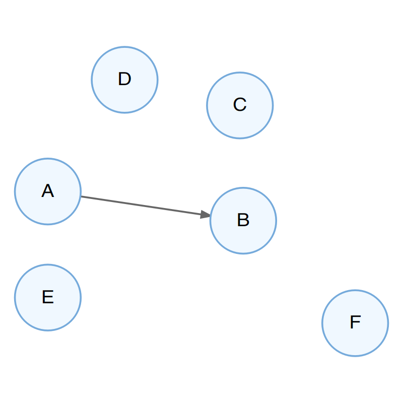
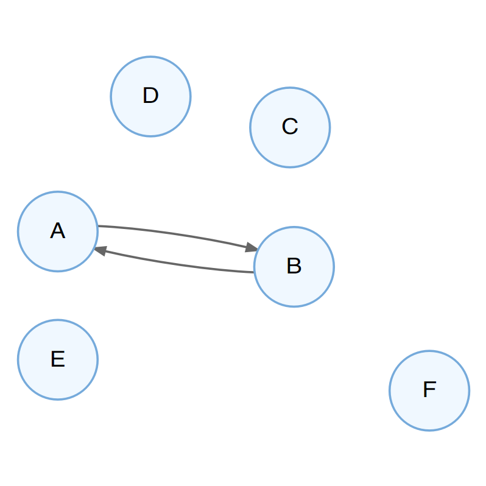
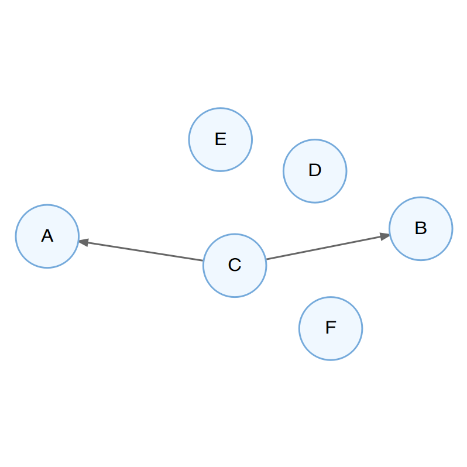
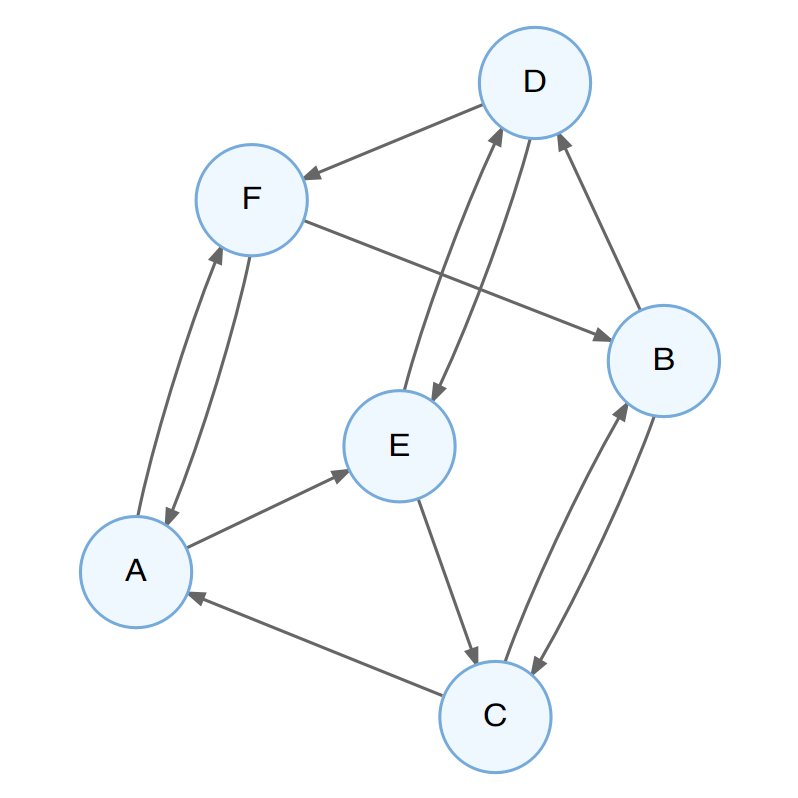

# Vom Zusammenhang zum Kausalzusammenhang

<!-- Was ist Kausalität -->
<!-- die ausprägung des einen merkmals (uv) verursacht die ausprägung des anderer merkmals (av). -->
<!-- oder UV wirkt auf AV. -->
<!-- Richtung einer Wirkbeziehung -->

Wir haben bereits im letzten Kapitel gesehen, dass ein beobachteter Zusammenhang zwischen zwei Variablen nicht ausreicht,
um anzunehmen, dass es einen unmittelbaren (d.h einen direkten, nicht über eine andere Variable vermittelten) Zusammenhang zwischen diesen beiden Variablen gibt.
In diesem Kapitel werden wir diesen Gedankengang erweitern, indem wir betrachten,
unter welchen Bedingungen wir von einem beobachteten Zusammenhang auf einen Zusammenhang schließen können,
der eine bestimmte Ursache-Wirkung Beziehung zwischen diesen beiden Variablen annimmt.

Das bedeutet, wir stellen uns die Frage, unter welchen Bedingungen wir annehmen können,
dass die eine Variable die andere Variable *kausal* (d.h. ursächlich) beeinflusst hat.
Es geht also um einen Einfluss, der einerseits direkt von der einen auf die andere Variable wirkt,
andererseits um eine eine eindeutige Richtung dieser Wirkbeziehung, also direkt von der UV auf die AV.

## Voraussetzungen für kausale Schlüsse

Wollen wir die Annahme bestätigen, dass eine UV eine AV kausal bedingt, müssen
drei Bedingungen erfüllt sein:

- Kovariation
- Präzedenz (zeitliche Vorgeordnetheit) der Ursache
- Ausschluss von Alternativerklärungen

*Kovariation*. Es muss ein gemeinsames Variieren der beiden Variablen beobachtet werden können.
Solch ein gemeinsames Variieren können mir mithilfe üblicher statistischer Kennwerte feststellen.

*Präzedenz*.
Die UV muss der AV zeitlich vorgeordnet sein.
Hierbei geht es *nicht* darum, welche Variable zuerst gemessen wurde,
sondern darum, was zeitlich früher eingetreten ist.

*Ausschluss von Alternativerklärungen*.
Wie wir bereits gesehen haben, können wir auch dann eine Kovariation zweier Variablen auch dann beobachten,
wenn sie sich nicht einander bedingen, sondern wenn beide gleichermaßen durch eine dritte Variable bedingt werden.
Will man also tatsächlich auf ein Bedingungsgefüge einer einzelnen Variable auf eine andere Variable schließen können,
muss der Einfluss der Gesamtheit aller Drittvariablen kontrolliert werden.
Um die Koviariation zweier Variablen festzustellen, genügen uns die Mittel der Statistik;
der Ausschluss von Alternativerklärungen lässt sich jedoch nur erreichen, indem unsere Untersuchung so geplant ist,
dass ihre Ergebnisse nicht durch eine andere Erklärung als ein Wirkgefüge unserer beiden interessierendn Variablen erklärbar ist.
Eine Untersuchung, die es schafft, tatsächlich alle relevanten Alternativerklärungen auszuschließen,
bezeichnen wir als *intern valide*.


## Vom Zusammenhang zum Kausalschluss

Stellen wir uns vor, wir beobachten einen Zusammenhang zwischen zwei Variablen A und B.
Wie ließe sich dieser Zusammenhang kausal erklären?

1. Die Ausprägung von A beeinflusst die Ausprägung von B, d.h. es liegt eine kausale Wirkbeziehung von A auf B vor (Abbildung \@ref(fig:a-causes-b))
```{r a-causes-b, fig.margin = TRUE, fig.cap = "Ein mögliches Kausalmodell: A beeinflusst B."}
# source("R/causation_models.R")
# par(mfrow = c(2, 2))
# render_graph(causality_graph)
# render_graph(causality_graph_2)
# render_graph(causality_graph_3)
# render_graph(causality_graph_4)
# render_graph(causality_graph_5)

```
2. Die Ausprägung von B beeinflusst die Ausprägung von A, also eine Wirkbeziehung in die gegenteilige Richtung vorliegt (Abbildung \@ref(fig:b-causes-a)).
```{r b-causes-a, fig.margin = TRUE, fig.cap = "Ein mögliches Kausalmodell: B beeinflusst A."}

```
3. Die Ausprägungen von A und B beeinflussen sich wechselseitig (Abbildung \@ref(fig:a-causes-b-causes-a)).
```{r a-causes-b-causes-a, fig.margin = TRUE, fig.cap = "Ein mögliches Kausalmodell: A und B beeinflussen sich wechselseitig."}

```
4. Eine weitere Variable C beeinflusst die Variablen A und B, diese beeinflussen sich aber nicht gegenseitig (Abbildung \@ref(fig:c-causes-a-b)).
```{r c-causes-a-b, fig.margin = TRUE, fig.cap = "Ein mögliches Kausalmodell: C beeinflusst A und B."}

```
5. Multi-Determiniertheit: Variable A hat keinen direkten Einfluss auf B, aber es gibt vielfache Wechselwirkungen über die Variablen C-F(Abbildung \@ref(fig:multiple-causes)).
```{r multiple-causes, fig.margin = TRUE, fig.cap = "Ein mögliches Kausalmodell: Multi-Determiniertheit."}

```

Stellen wir uns nun vor, wir beobachten einen klaren Nullzusammenhang zwischen zwei Variablen A und B.
Wie ließe sich dieses Nicht-Vorhandensein eines Zusammenhangs kausal erklären?

1. Variable A hat keine Einfluss auf Variable B und Variable B hat keinen Einfluss auf Variable A -- es besteht kein Wirkgefüge zwischen den beiden Variablen.
2. Es gibt ein kausales Wirkgefüge zwischen den beiden Variablen, dieses wird jedoch durch den Einfluss einer oder mehrerer Drittvariablen verdeckt. Beispielsweise könnte die Wirksamkeit eines Medikaments auf die Symptome einer Krankheit davon abhängen, ob eine bestimmte genetische Disposition des Patienten vorliegt oder nicht.
3. In unserer Untersuchung beobachten wir nur einen Teil der Variationsbreite der beiden Variablen, in dem es keinen Zusammenhang gibt; in einem anderen Wertebereich könnte es aber sehr wohl einen Zusammenhang geben. Beispielsweise könnte es sein, dass  es so scheint, dass ein Medikament nicht die erwünschte Wirkung auf eine Krankheit hat. Vielleicht war aber in unserer Untersuchung die Dosis zu gering und das Medikament könnte sehr wohl wirken, wenn man es höher dosierte.


## Die Grundidee

- Bleirohre/IQ-Beispiel (besseres Beispiel -- oder genau richtig, da es auch klar macht, dass man nicht für alle Fragen Experimente durchführen kann?)
- Beispiele für spurious correlations
- Einführung der experimentellen Methode:
    - zufälliges Zuteilen von Personen auf Wohnblocks mit/ohne Bleirohr
    - Worauf könnte dann noch ein IQ-Unterschied zurückgeführt werden?
    - Zufällige Schwankungen oder Ursache-Wirkung

<!-- Problem: -->
<!-- Statistische Kontrolle von störvariablen, aber nicht von vermittelnden variablen. -->

Warum ist es wichtig, hypothesengeleitet vorzugehen?

- Logischer Empirismus vs. Falsifikationismus
    - schwäne (Schnipsel-Forscher von Karoline)


<!--
Meehl-Argument:

- "reife" naturwissenschaften: Theorie sagt einen bestimmenten numerischen Wert
(oder z.B. die Gleichheit von zwei Werten) vorher
- Beispiel:
    - Aristoteles: „Wenn man eine Kugel von Blei und eine von Holz von einem hohen Turm fallen läßt, bewegt sich das Blei weit voraus.“
    - Stevin und andere: Gleichförmige Beschleunigung, d.h. egal wie "schwer" die Körper sind, sie treffen gleichzeitig auf.
- Stevin bzw. Benedetti-Experiment
Immer dann, wenn ein Test "signifikant" wird, wird eine Theorie falsifiziert
- Sozialwisschenschaften/Psychologie/Bildungswissenschaften/Ernährungswissenschaften
- Theorie sagt etwas darüber aus, dass etwas einen Einfluss hat (also der Zusammenhang  nicht Null ist)
    - Beispiel: Koffeinkonsum ~ Bluthochdruck
Immer dann, wenn ein statistischer Test signifikant wird, wird eine Theorie "bestätigt"
Wird sie das wirklich?
-->
- Warum ist es wichtig, hypothesengeleitet vorzugehen?

- Beispiel: Wir sind Forscher, die möglichst viele Verhaltensweisen identifizieren wollen, die Herz-Kreislauf-Erkrankungen verursachen.
