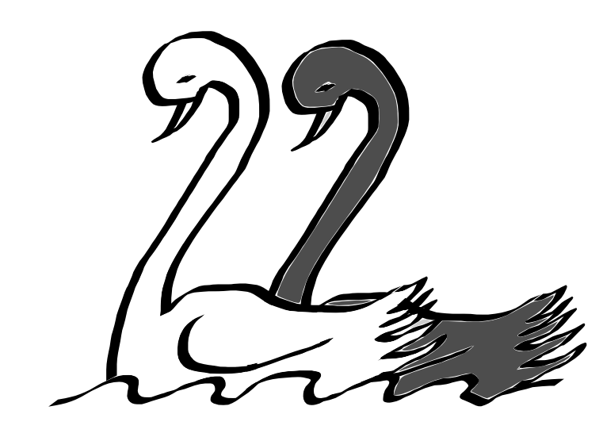

# Überprüfung und Bestätigung

David Hume (Hume, 1748) definierte das *Induktionsproblem*:
Wir können niemals von den bisher beobachteten Fällen auf alle Fälle schließen.
Popper (Popper, 1934) führte diesen Gedanken folgendermaßen aus:
Induktion ist der Schluss von *besonderen Sätzen* (Beobachtungen, Experimenten) auf allgemeine Sätze (Hypothesen und Theorien).
Dieser Schluss ist aber im Sinne der formalen Logik nicht zulässig, denn wir können so viele weiße Schwäne beobachten wie wir wollen, wir können trotzdem nicht einfach schließen, dass *alle* Schwäne weiß sind -- wir können also unsere Beobachtung nicht verallgemeinern.

```{r popper-swane, fig.margin = TRUE, fig.cap = "Nur weil man viele weiße Schwäne gesehen hat, kann man nicht behaupten, dass alle Schwäne weiß sind.", out.width = "100%"}

```

Popper schlug eine deduktive Überprüfung von Theorien vor, die als *kritischer Rationalismus* bekannt wurde:
Man leitet aus der Theorie Hypothesen und Vorhersagen ab, die man überprüfen kann.
Es muss dabei möglich sein, ein Ereignis beobachten zu können, das die Theorie *falsifiziert*.
Ist dies nicht möglich, die Theorie ist also prinzipiell mit jedem möglichen Ereignis vereinbar, ist sie *nicht wissenschaftlich*.

Die Theorie kann ihre Überprüfung immer nur vorläufig bestehen; es ist immer möglich, dass sie zu einem späteren Zeitpunkt widerlegt wird.
Das bedeutet auch, dass wir sie niemals *bestätigen* können.
Wenn eine Theorie jedoch immer wieder deduktiven Nachprüfungen standhält, gilt sie als *bewährt*.

## Wissenschaft und Pseudowissenschaft

Für Popper (1963) ist das Kriterium der Wissenschaftlichkeit die *Falsifizierbarkeit*,
d.h. dass eine Theorie durch ein Ereignis widerlegt werden kann.
Einsteins Gravitationstheorie ist für ihn eine wissenschaftliche Theorie, da sie überprüfbare und falsifizierbare Vorhersagen macht.
Marxismus und Astrologie waren für ihn Beispiele unwissenschaftlicher Theorien, da ihre Vorhersagen so vage seien, dass sie nicht mehr falsifiziert werden könnten. Die psychoanalytische Theorie nach Freud war für ihn ebenfalls eine unwissenschaftliche Theorie:
Es sei kein menschliches Verhalten denkbar, das mit der Theorie nicht erklärbar sei.

Imre Lakatos (Lakatos, 1973) erweiterte jedoch diesen Gedanken:
Er nahm an, dass Wissenschaft nicht nur ein Prozess von Versuch und Irrtum sei,
wie es der kritische Rationalismus nach Popper annimmt.
Eine gute oder nützliche Theorie könne sich nicht einfach von einer schlechten dadurch unterscheiden,
dass sie noch nicht widerlegt sei, denn auch nützliche Theorien wie die Newtonsche Mechanik oder Einsteins Relativitätstheorie
seien schnell widerlegt worden.
Ihr Gewinn bestehe vielmehr darin, dass sie interessante und ungeahnte Vorhersagen gemacht hätten,
die den Erkenntnisprozess vorangetrieben hätten.
Die Einheit, deren Erfolg oder Misserfolg man bewerten solle, sei deshalb nicht die einzelne Theorie oder Hypothese,
sondern dies seien *Forschungsprogramme*: Strömungen von Theorien, Methoden und Hilfsannahmen, die entweder erfolgreich sein können oder degenerieren.
Erfolgreiche Forschungsprogramme zeichneten sich dadurch aus, dass Theorien neue Vorhersagen machen, die auch einer Überprüfung standhalten;
dies muss jedoch nicht immer gegeben sein, solange die Theorie konstruktiv weiterentwickelt werden kann.
*Degenerierende* Forschungsprogramme seien solche, bei denen die Theorie den Tatsachen hinterherhinke,
also ständiger Überarbeitung bedarf, um noch die neuen Ergebnisse und Beobachtungen erklären zu können.
Der Wettbewerb von Forschungsprogrammen, also das Versiegen von degenerierenden und das Prosperieren erfolgreicher Programme,
führe letztlich zu wissenschaftlichem Fortschritt.


<!-- Die Grundidee -->

<!-- - Bleirohre/IQ-Beispiel (besseres Beispiel -- oder genau richtig, da es auch klar macht, dass man nicht für alle Fragen Experimente durchführen kann?) -->
<!-- - Beispiele für spurious correlations -->
<!-- - Einführung der experimentellen Methode: -->
<!--     - zufälliges Zuteilen von Personen auf Wohnblocks mit/ohne Bleirohr -->
<!--     - Worauf könnte dann noch ein IQ-Unterschied zurückgeführt werden? -->
<!--     - Zufällige Schwankungen oder Ursache-Wirkung -->


<!-- - Warum ist es wichtig, hypothesengeleitet vorzugehen? -->

<!-- - Beispiel: Wir sind Forscher, die möglichst viele Verhaltensweisen identifizieren wollen, die Herz-Kreislauf-Erkrankungen verursachen. -->


<!--
Meehl-Argument:

- "reife" naturwissenschaften: Theorie sagt einen bestimmenten numerischen Wert
(oder z.B. die Gleichheit von zwei Werten) vorher
- Beispiel:
    - Aristoteles: „Wenn man eine Kugel von Blei und eine von Holz von einem hohen Turm fallen lässt, bewegt sich das Blei weit voraus.“
    - Stevin und andere: Gleichförmige Beschleunigung, d.h. egal wie "schwer" die Körper sind, sie treffen gleichzeitig auf.
- Stevin bzw. Benedetti-Experiment
Immer dann, wenn ein Test "signifikant" wird, wird eine Theorie falsifiziert
- Sozialwisschenschaften/Psychologie/Bildungswissenschaften/Ernährungswissenschaften
- Theorie sagt etwas darüber aus, dass etwas einen Einfluss hat (also der Zusammenhang  nicht Null ist)
    - Beispiel: Koffeinkonsum ~ Bluthochdruck
Immer dann, wenn ein statistischer Test signifikant wird, wird eine Theorie "bestätigt"
Wird sie das wirklich?
-->
